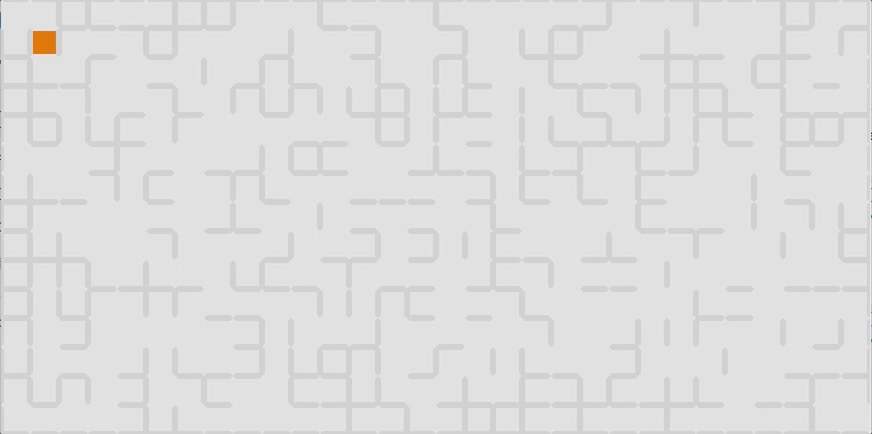

# You're Lost
You find yourself as an orange square, in a series of corridors that turn left then right then back to the left. It's a never ending maze. How will you find your way out? Is it even possible? The maze seems to go on forever and ever.



## The Maze
The maze is simple. It is a JSON object with an array of cells in the format:

```
this.data = {
  cells: [
    {
      u: true,
      r: true,
      d: true,
      l: true
    },
    ...
  ]
}
```

Each cell contains 4 properties: (u)p, (r)ight, (d)own, (l)eft. These are boolean values that represent whether you can go that direction or not from that cell. The maze can be any size by changing the url parameters to include `height=___&width=___`. If the parameters are not included the default maze size is 100 wide and 50 high.

**The maze doesn't render correctly in the browser at widths over 190.**

The maze is randomly generated but can be seeded by using the `seed=___` url parameter in order to do repeatable mazes to test and compete with.

## Player
The player is the code that instructs how to navigate the maze. To move in the maze, call one of the maze movement functions:

```
maze.moveUp();
maze.moveRight();
maze.moveDown();
maze.moveLeft();
```

When you reach a point where you have either made it to the final square of the maze (`maze.height * maze.width - 1`), or you think that the maze is unsolvable, then call the `maze.stop(solvable)` function and your answer to whether you solved it or not. This will initiate a playback of your journey through the maze for you to see.

## Maze API

`currentIdx()` - returns the current location of the player in the maze. The maze is indexed 0 -> `maze.height * maze.width - 1`. **It is not row and column ordered.**

`getAvailableDirections()` - returns the cell object that contains what directions are valid to move. For example:
```
  {
    u: true,
    r: true,
    d: true,
    l: true
  }
```

`idxForMove(direction)` - returns the index number of the destination after a move would be made in that direction. the direction should be passed in as a string matching the directions in available directions object. (i.e. `u`, `r`, `d`, `l`)

`moveUp()` - moves the player Up in the maze and returns the new current index of the player. If `moveUp()` is called when it is not an available move, then the current index is returned and no move is recorded.

`moveRight()` - moves the player Right in the maze and returns the new current index of the player. If `moveRight()` is called when it is not an available move, then the current index is returned and no move is recorded.

`moveDown()` - moves the player Down in the maze and returns the new current index of the player. If `moveDown()` is called when it is not an available move, then the current index is returned and no move is recorded.

`moveLeft()` - moves the player Left in the maze and returns the new current index of the player. If `moveLeft()` is called when it is not an available move, then the current index is returned and no move is recorded.

`stop(solvable)` - should be called when a player has either completed the maze or they have determined the maze to not be solvable and they are lost forever. This initiates the playback of the journey through the maze for all to see.
